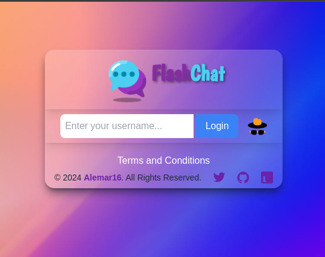

# Flash Chat

  

## Introduction

Flash Chat is a secure and anonymous chat application offering a revolutionary platform for communication. With a focus on user privacy, Flash Chat ensures that no data is stored once the session is closed, providing users with peace of mind during their conversations.

## Key Features

- **Secure and Anonymous Communication**: Users can choose to log in with a username or anonymously, with all data automatically deleted upon session closure.
- **Real-time Messaging**: Enjoy seamless real-time messaging with the help of Socket.IO, ensuring instant communication.
- **User-friendly Interface**: The application is built with React.js and styled using Tailwind CSS, providing a sleek and intuitive user interface.
- **Customizable Alerts**: Integration with SweetAlert2 enhances user experience with customizable alerts and notifications.
- **Easy Setup**: The project is divided into frontend and server directories, making setup hassle-free. Simply install dependencies with npm and run the project in development mode.

## Technologies Used

- React.js with Vite for frontend development
- Socket.IO for real-time communication
- SweetAlert2 for enhanced user alerts
- Node.js and Express for backend development
- Tailwind CSS for styling

## Getting Started

To begin using Flash Chat, ensure you have Node.js version 20.11.1 installed on your system. Navigate to the project's frontend and server directories and run `npm install` to install dependencies. Then, start the project in development mode by running `npm run dev`.

## Try It Out

Experience Flash Chat firsthand by visiting our live application at [https://chat-socketio-n9to.onrender.com/](https://chat-socketio-n9to.onrender.com/). We value your feedback and invite you to explore the application. Don't forget to star our GitHub repository to show your support!

## Application Screenshots

## Thank You for Your Support!

We extend our sincere gratitude to all users for choosing Flash Chat. Your continued support drives us to innovate and improve. Let's chat securely and anonymously together!
